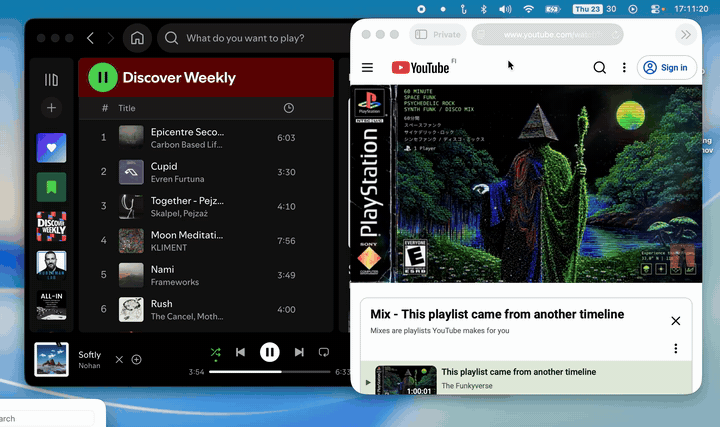

<p align="center">
  <picture>
    <source media="(prefers-color-scheme: dark)" srcset="docs/icon-dark.png">
    
  </picture>
</p>

<h1 align="center">Beamhook</h1>

<p align="center">Your media keys, hooked to the app you meant.</p>

<p align="center">
  <a href="https://beamhook.app/"><b>Website</b></a>
  &nbsp;•&nbsp;
  <a href="https://ppixu.gumroad.com/l/beamhook"><b>Get the official build (€5)</b></a>
</p>

---

<p align="center">
  
</p>

Beamhook makes your Mac's media keys predictable. It sends play/pause,
next, and previous to **one app you choose** — so macOS can't redirect them
to Apple Music, YouTube, or whichever player it remembers. It also lets you
control the volume of apps that are currently playing audio, when the app
supports AppleScript. Requires macOS 14.0 or later; the active-audio source list
requires macOS 14.2. Tested on macOS Tahoe 26.5.

## Features

- Hook the media keys to one target app — nothing else can steal them.
- Play/pause button that reflects what's actually playing.
- Volume sliders for scriptable apps that are currently playing audio, whether
  or not they are hooked.
- Per-tab volume sliders for actively playing browser sources when JavaScript
  from Apple Events is enabled.
- Optionally route the keyboard's volume keys to the selected app.
- Hold Command while pressing a volume key to adjust the Mac's system volume instead.
- Built in: Spotify, Apple Music, Apple TV, Safari, Chrome, Brave, Arc,
  Vivaldi, VLC, VOX, QuickTime Player, and Downcast.
- Add another app with your own AppleScript commands.

Some apps do not expose suitable AppleScript controls and cannot be controlled
this way.

The browser targets control the active YouTube tab. Enable **Allow JavaScript
from Apple Events** in Safari's Develop menu or the Chromium browser's
View → Developer menu before using them.

## Build it yourself — free

```bash
git clone https://github.com/ppixu/beamhook
cd beamhook
brew install xcodegen
./run.sh
```

Then grant **Accessibility** when prompted, pick your app, and press play.

## Or get the official build — €5

Rather not build it yourself? The **€5 one-time purchase** on Gumroad includes
the signed and notarized, ready-to-run app and all Beamhook 1.x updates. It is
the same complete app as the open-source version, and your purchase supports
continued development.

[](https://ppixu.gumroad.com/l/beamhook)

## License

[GPL-3.0](LICENSE). Use it, study it, change it, share it — derivative works
must stay under the GPL.
