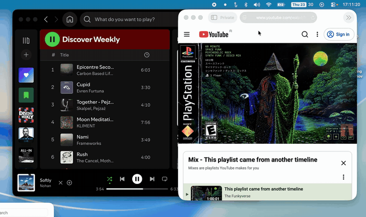

<p align="center">
  <picture>
    <source media="(prefers-color-scheme: dark)" srcset="docs/mark-dark.svg">
    
  </picture>
</p>

<h1 align="center">Beamhook</h1>

<p align="center">Control each app’s volume. Hook your Mac’s media keys.</p>

<p align="center">
  <a href="https://beamhook.app/"><b>Website</b></a>
  &nbsp;•&nbsp;
  <a href="https://ppixu.gumroad.com/l/beamhook"><b>Get the official build (€5)</b></a>
  &nbsp;•&nbsp;
  <a href="https://github.com/ppixu/beamhook/issues"><b>Report a bug</b></a>
</p>

---

<p align="center">
  
</p>

Beamhook is a menu-bar app that does two things:

- **Per-app volume.** Every app playing sound gets its own volume slider and
  mute button, and browsers get one for each tab. Turn Spotify down or mute a
  noisy app without touching anything else.
- **Media keys that stay put.** Play/pause, next and previous go to **one app
  you choose**, not to Apple Music, a forgotten YouTube tab, or whatever macOS
  remembers.

Requires macOS 14.0 or later. Per-app volume for apps without their own volume
control needs macOS 14.2. Tested on macOS Tahoe 26.5.

> [!IMPORTANT]
> Firefox is not supported. Browser control works with Safari, Chrome, Brave,
> Arc, and Vivaldi.

## Features

### Volume and mute

- A volume slider (0–100%) and mute button for each app that is playing or
  played recently. **Show all** lists the rest.
- Works for apps with no AppleScript, such as Electron and chat apps, through a
  Core Audio process tap. This needs macOS 14.2 and the System Audio Recording
  permission. Audio is adjusted live and never stored. Apps with their own
  volume control are adjusted through it instead.
- A browser's row sets the whole browser. The indented rows under it set single
  tabs, which needs [JavaScript from Apple Events](https://beamhook.app/help/).
- Levels are remembered per app. Unmuting restores the previous level, and
  raising a muted slider unmutes it.
- The speaker arcs animate while sound plays. The number of arcs follows the
  volume setting, not loudness.
- Process taps support mono and stereo Float32 output. Other formats show an
  error and leave the sound alone.
- Turn off **Per-app volume and mute** in Settings to restore normal output and
  clear saved levels.

### Media keys

- Hook the media keys to one app or browser tab. Nothing else can take them.
- On podcasts, ⏭/⏮ skip forward and back instead of changing track: Spotify
  episodes, Apple Podcasts, long videos and pages without a next button.
  Playlists and albums keep next/previous. Settings can turn this off or make
  the keys always skip.
- If the hooked app isn't running, play/pause starts it. (An app launched with
  an empty queue, such as TIDAL, has nothing to play.) Can be turned off in
  Settings.
- Optionally send the volume keys to the hooked app too. ⌘ + volume then
  controls system volume. With the volume keys left to the system, it's the
  other way around: ⌘ + volume controls the hooked app.
- ⌘ + Mute mutes the hooked app, following the same rule. The menu-bar icon
  shows a slash while it's muted.
- Spotify shows the current artist and song in the menu and the overlay.

### Keyboard picker

Press ⌘ + a volume key or ⌘ + Play to open the source picker, or ⌘ + an arrow
key while a Beamhook overlay is showing.

- ⌘↑ / ⌘↓ selects a source.
- ⌘← / ⌘→ changes its volume.
- ⌘ + Play plays or pauses it, ⌘ + Mute mutes it, ⌘ + H hooks it.

With the volume keys routed to the hooked app, the plain volume keys open the
picker and the shortcuts work without ⌘. Otherwise the picker closes when you
let go of ⌘.

### Supported apps

- AppleScript: Spotify, Apple Music, Apple TV, VLC, VOX, QuickTime Player and
  Downcast.
- Browsers: Safari, Chrome, Brave, Arc and Vivaldi. You pick the tab. Turn on
  **Allow JavaScript from Apple Events** first
  ([guide with pictures](https://beamhook.app/help/)).
- Through their menus: IINA, Amazon Music, Plexamp, Deezer and Podcasts.
  Only IINA is tested so far. If one doesn't respond,
  [open an issue](https://github.com/ppixu/beamhook/issues).
- Any other app, with your own AppleScript commands. Some apps don't offer the
  AppleScript controls this needs.

Recently played tabs stay listed for two hours after pausing, up to three per
browser. Closed tabs drop off on the next scan, and the list clears when
Beamhook quits.

## Build it yourself — free

```bash
git clone https://github.com/ppixu/beamhook
cd beamhook
brew install xcodegen
./run.sh
```

Then grant **Accessibility** when prompted, pick your app, and press play.

## Or get the official build — €5

Rather not build it? The **€5 one-time purchase** on Gumroad gets you the
signed, notarized, ready-to-run app with all 1.x updates. It's the same app as
the source, and buying it supports development.

[](https://ppixu.gumroad.com/l/beamhook)

## Bugs and requests

Found a bug, or want another app supported?
[Open an issue](https://github.com/ppixu/beamhook/issues), whether you bought
the app or built it yourself. Check the existing issues first, and include your
macOS version, Beamhook version and the app you were controlling.

## License

[GPL-3.0](LICENSE). Use it, change it and share it. Derivative works must
stay under the GPL.
